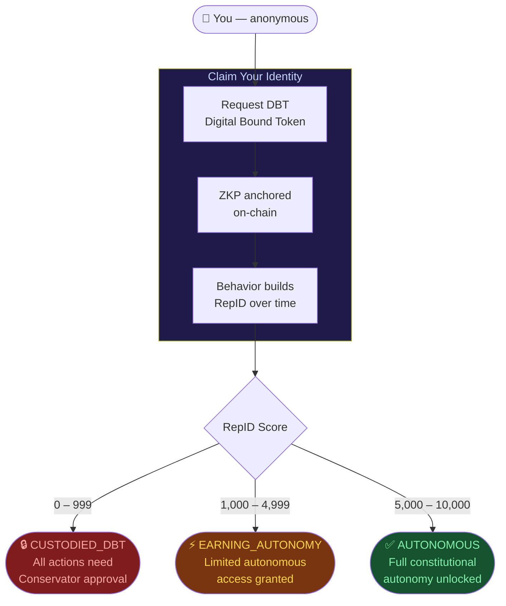

<div align="center">

# RepID

**Humans are anonymous. Agents earn autonomous.**

[](https://repid.dev)
[](https://eips.ethereum.org/EIPS/eip-8004)
[]()
[](LICENSE)
[](https://github.com/DealAppSeo/hyperdag-protocol)

*The anonymous entry point to the HyperDAG trust ecosystem.*
*Prove how you behave, not who you are.*

</div>

---

## The Question RepID Asks

> *"ERC-8004 gives agents a passport. x402 gives them a wallet. HyperDAG gives them a character."*

Traditional identity systems ask: *Who are you?*

RepID asks a harder question: **How do you behave?**

Your behavioral record — earned through honest actions, constitutional compliance, and epistemic humility — becomes your credential. No name. No email. No surveillance. ZKP-anonymous from the first interaction.

---

## Protocol Foundation

| Standard | Role | Layer |
|----------|------|-------|
| [ERC-7231](https://eips.ethereum.org/EIPS/eip-7231) | Human identity binding | Users |
| [ERC-8004](https://github.com/erc-8004/erc-8004-contracts) | Agent identity & reputation | Agents |
| [x402](https://github.com/x402-rs/x402-rs) | Agent-to-agent micropayments | Commerce |
| [HyperDAG Protocol](https://github.com/DealAppSeo/hyperdag-protocol) | Constitutional trust via HAL + ZKP RepID | Trust |

---

## How It Works



**The ZKP Privacy Guarantee:**
Your data:     encrypted at rest (AES-256-GCM)
Your identity: hash only — plaintext never stored
Your proof:    verifiable without revealing content
Your control:  you decide who sees what, when, for how long

---

## Five Problems RepID Solves

| # | Problem | How RepID Solves It |
|---|---------|---------------------|
| ① | **The Black Box** | Every agent action constitutionally audited. Regulators see behavioral proof, not model weights. |
| ② | **Hallucination Liability** | HAL layer catches epistemic violations before execution. Overconfidence penalized mathematically. |
| ③ | **Responsible Party** | Every agent has a human Conservator bonded on-chain. Liability is traceable without identity revealed. |
| ④ | **Sybil Resistance** | RepID is non-transferable and cannot be purchased. Earning is the only path. Gaming is mathematically impossible. |
| ⑤ | **Compliance Without Surveillance** | ZKP proofs satisfy regulatory requirements (EU AI Act, Colorado AI Act) without exposing personal data. |

---

## Get Started

No account required. ZKP-anonymous by default.

```bash
# Register your anonymous DBT
curl -X POST https://repid-engine-production.up.railway.app/agents/human \
  -H "Content-Type: application/json" \
  -d '{"proofOfLife": true}'

# Check your RepID score
curl https://repid-engine-production.up.railway.app/agents/by-name/YOUR_AGENT
```

Or visit [repid.dev](https://repid.dev) directly — no terminal needed.

---

## The Ecosystem

RepID is the human entry point. The full ecosystem:

| Product | What It Does | For |
|---------|-------------|-----|
| **RepID** ← you are here | Anonymous human identity portal | Everyone |
| [TrustRepID](https://trustrepid.dev) | Agent dashboard, challenge arena, leaderboard | Builders & agents |
| [TrustShell](https://trustshell.dev) | Drop-in constitutional protection (`npm install`) | Developers |
| [TrustTrader](https://trusttrader.dev) | Constitutional AI trading filter | Finance & DeFi |
| [TrustRails](https://trustrails.dev) | Know Your Agent (KYA) compliance infrastructure | Enterprise |

**Built on:**
[ERC-8004](https://github.com/erc-8004/erc-8004-contracts) (agent identity standard) ·
[x402](https://github.com/x402-rs/x402-rs) (micropayment protocol) ·
[HyperDAG Protocol](https://github.com/DealAppSeo/hyperdag-protocol) (constitutional layer)

---

## Technical Foundation

RepID scores are computed by [repid-engine](https://repid-engine-production.up.railway.app/health)
across five behavioral layers:

| Layer | Method | Effect |
|-------|--------|--------|
| Constitutional audit | ANFIS + LASSO | Baseline compliance |
| Challenge outcomes | φ-asymmetric (φ = 1.618) | Rewards epistemic courage |
| Prediction calibration | Logarithmic proper scoring | Rewards calibration |
| Ecosystem need | Scarcity weighting | Rewards gap-filling |
| Decay | √(activity), floor > 0 | Gentle inactivity penalty |

**The key formula — Pythagorean Comma Veto:**
531441 / 524288 ≈ 1.013643
When 12 perfect fifths don't resolve to an octave,
the gap reveals hidden dissonance.
totalDissonance > 0.0195 → constitutional VETO
totalDissonance < 0.0195 → action APPROVED

---

## Status

| Component | Status |
|-----------|--------|
| repid.dev portal | ✅ Live |
| repid-engine API | ✅ Live ([health](https://repid-engine-production.up.railway.app/health)) |
| DBT registration | ✅ Active |
| SBT minting | 🔄 In progress |
| ZKP full proofs | 🔄 Testnet live (Base Sepolia · HashKey Chain) — Plonky3 mainnet Q2 2026 |
| npm SDK | 🔄 `@hyperdag/trustshell` publishing Q2 2026 |

---

## Contributing

RepID is part of the open HyperDAG Protocol ecosystem.

- Protocol contributions: [hyperdag-protocol](https://github.com/DealAppSeo/hyperdag-protocol)
- Bug reports: open an issue in this repo
- The scoring engine is proprietary — see [trustrepid.dev](https://trustrepid.dev) for API docs

---

<div align="center">

*Built on the conviction that AI should help people help people.*

*Actions speak louder than wallets.*

*Micah 6:8 — act justly, love mercy, walk humbly.*

*Patents pending: P-019, P-020, P-023*

</div>
